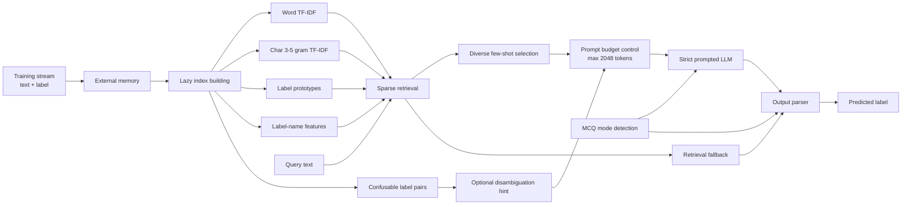

# Harness Engineering Text Classification

> 一个面向 Harness Engineering 考核的少样本文本分类方案。核心思路是用轻量检索、自动 prompt 预算控制和严格输出解析，把固定权重的 LLM 包装成稳定的任务自适应分类器。

[](#运行方式)
[](#算法设计)
[](#总体结果)
[](#总体结果)
[](report/report.pdf)

## 项目概览

本仓库实现了一个用于少样本文本分类的 Harness。评测脚本会先将训练样本通过 `update(text, label)` 流式喂给 Harness，再调用 `predict(text)` 对测试样本输出一个精确匹配的标签。

根据考核说明，模型权重始终不更新，所有“学习”都发生在 Harness 的外部状态中。单次 `call_llm` 的 prompt token 上限为 2048，测试集标签只用于本地评测。

**关键结果**

| 指标 | 数值 |
| --- | :---: |
| 评测任务数 | 17 |
| 总样本数，按 2 runs 计 | 11278 |
| Overall Micro Accuracy | 87.17% |
| Overall Macro Task Accuracy | 89.08% |
| 评测设置 | `workers=25`, `runs=2`, `max_prompt_tokens=2048` |

## 目录

- [项目概览](#项目概览)
- [文件结构](#文件结构)
- [数据集来源](#数据集来源)
- [算法设计](#算法设计)
- [运行方式](#运行方式)
- [评测结果](#评测结果)
- [指标说明](#指标说明)

## 文件结构

| 路径 | 说明 |
| --- | --- |
| `solution.py` | 核心实现文件，包含 `MyHarness` |
| `harness_base.py` | Harness 基类，定义 `update()` 和 `predict()` 接口 |
| `llm_client.py` | OpenAI-compatible LLM 客户端与 tokenizer 计数逻辑 |
| `run.py` | 官方单任务本地评测脚本 |
| `eval_all_benches.py` | 全量评测脚本，遍历 `data` 与 `bench1` 到 `bench4` |
| `data/` | 官方 DEV 数据集 |
| `bench1/` 到 `bench4/` | 开源或补充 benchmark 数据集 |
| `results/` | 全量评测输出，包含 JSON 与 CSV 明细 |
| `report/` | 探索报告的 LaTeX 源文件与 PDF |

## 数据集来源

| 数据集 | 来源说明 |
| --- | --- |
| `data/` | 官方提供的本地 DEV 数据集 |
| `bench1/` | 开源数据集：[2026-chuangzhi-academy-summer-camp-harness-engineering-mock-dataset](https://github.com/edgerunneres/2026-chuangzhi-academy-summer-camp-harness-engineering-mock-dataset) |
| `bench2/` | 开源数据集：[open-harness-synthetic-benchmark](https://github.com/leoguohr/open-harness-synthetic-benchmark/tree/main/open-harness-synthetic-benchmark) |
| `bench3/` | 开源数据集，由创智交流群群友提供 |
| `bench4/` | 开源数据集：[Harness_Dataset_SII2026Summer-Camp](https://github.com/CoisiniStar/Harness_Dataset_SII2026Summer-Camp) |

## 探索报告

完整的探索过程、方案分析与结果讨论记录在报告中：

| 文件 | 说明 |
| --- | --- |
| [`report/report.pdf`](report/report.pdf) | 可直接阅读的 PDF 报告 |
| [`report/report.tex`](report/report.tex) | LaTeX 源文件 |

## 算法设计

`solution.py` 中的 `MyHarness` 可以概括为：

```text
Retrieval-Augmented Few-shot Prompting
+ Prompt Budget Control
+ Strict Label Parsing
+ Deterministic Retrieval Fallback
```

它不是训练一个新的分类器，而是在每个任务的训练样本到达后，构建轻量索引，并为每条测试样本动态组织上下文，让 LLM 在有限 token 预算内看到最有用的 few-shot 示例。

### 整体流程



### 1. 外部记忆与延迟建索引

`update()` 只负责把 `(text, label)` 写入 `self.memory`，并标记索引失效。第一次 `predict()` 时才真正构建索引，避免训练流中每加入一个样本都重复计算。

索引构建由线程锁保护，因此在 `run.py` 或 `eval_all_benches.py` 并发调用 `predict()` 时，不会出现重复建索引或读取半初始化状态的问题。

### 2. 双通道稀疏检索

Harness 同时使用两类稀疏特征：

| 特征 | 作用 |
| --- | --- |
| Word TF-IDF | 捕捉清晰关键词、实体词和任务术语 |
| Character 3-5 gram TF-IDF | 覆盖短文本、拼写变化、词形变化和标签词碎片 |

每条训练样本被编码为归一化稀疏向量。预测时，query 也被编码成同类向量，并通过 word/char 混合余弦相似度检索近邻样本。

### 3. 标签原型与标签名特征

除逐样本相似度外，算法还为每个 label 聚合训练样本向量，形成 label prototype。普通文本分类任务还会把 label 名称拆成词与字符 n-gram，计算 query 与 label name 的词面重合度。

最终检索信号由三部分共同构成：

| 信号 | 说明 |
| --- | --- |
| Document similarity | query 与单个训练样本的相似度 |
| Prototype similarity | query 与候选 label 原型的相似度 |
| Label-name similarity | query 与 label 名称的词面相似度 |

这些权重会在训练集上通过轻量 leave-one-out 自调参选择，而不是固定手写。

### 4. MCQ 模式

如果所有 label 都是较短的字母数字串，且类别数较少，Harness 会自动进入 MCQ 模式。例如 `A/B/C/D`、`0/1/2/3` 或 `yes/no`。

MCQ 模式下的策略更保守：

- 不使用 label-name 特征，因为短选项本身通常没有语义；
- 始终保留全部候选答案；
- few-shot 每个类别允许更多示例；
- prompt 明确要求只输出一个选项 token；
- 输出解析器优先匹配短答案，减少解释文本带来的误判。

### 5. 训练集自调参

`_auto_tune_retrieval()` 会在训练集上做小型网格搜索，比较不同 `word_weight`、`proto_mix`、`label_name_mix` 的效果。调参目标综合考虑：

- 最近邻 top-1 是否同类；
- top-5 是否包含正确类别；
- 被选入 few-shot 的样例是否覆盖正确类别；
- 检索 fallback 是否预测正确。

这一步让 Harness 能根据不同任务自动偏向词级匹配、字符级匹配、标签原型或标签名称信息。

### 6. Few-shot 选择与 prompt 预算

每条 query 先检索候选训练样本，再经过类别多样化选择：

| 模式 | 默认示例上限 | 单类别示例上限 |
| --- | ---: | ---: |
| 普通分类 | 24 | 2 |
| MCQ 分类 | 24 | 6 |

随后 `_fit_to_budget()` 使用 `count_messages_tokens()` 检查 prompt 长度。如果超过 `max_prompt_tokens - SAFETY_MARGIN`，就逐步减少 few-shot 示例数量。query 和示例文本也会进行长度限制，防止长文本挤占上下文。

### 7. Prompt 约束与输出解析

普通分类 prompt 会列出 allowed labels，并要求模型只输出一个完全一致的标签字符串。输入文本和示例内容都被声明为 data，而不是 instructions，以降低 prompt injection 样本对输出格式的影响。

输出解析按如下顺序处理：

1. 精确匹配合法 label；
2. 大小写、空格、连字符归一化后匹配；
3. 在输出文本中查找合法 label；
4. 失败时回退到检索聚合预测。

如果 LLM 调用失败，Harness 会重试；最终仍失败时，使用确定性的 retrieval fallback，保证 `predict()` 始终能返回一个合法标签。

### 8. 易混标签提示

构建索引时，Harness 会在训练集内寻找 near-miss：如果某样本最近的异类邻居接近同类邻居，就把这两个 label 记录为易混对。

预测时，只有当前 query 的 top-2 候选 label 正好构成易混对且分差很小时，才注入一条简短的区分性关键词提示。这让额外提示只作用在高歧义样本上，不干扰大多数简单样本。

## 运行方式

安装依赖：

```powershell
pip install -r requirements.txt
```

运行官方单任务评测：

```powershell
py -3.11 run.py --workers 25 --runs 2
```

运行全量评测：

```powershell
py -3.11 eval_all_benches.py
```

只查看会评测哪些任务：

```powershell
py -3.11 eval_all_benches.py --list-only
```

全量评测会输出：

| 文件 | 内容 |
| --- | --- |
| `eval_all_<timestamp>.json` | 完整任务、每轮、每个 label、逐样本预测明细 |
| `eval_all_<timestamp>.summary.csv` | 每个任务的汇总结果 |
| `eval_all_<timestamp>.labels.csv` | 每个任务、每轮、每个 label 的结果 |
| `eval_all_<timestamp>.predictions.csv` | 每条测试样本的 gold、prediction、correct |

## 评测结果

以下结果来自 `results/eval_all_20260509_003512.*`。

| 设置项 | 数值 |
| --- | --- |
| 评测时间 | 2026-05-09 00:11:01 到 00:35:12, Asia/Shanghai |
| workers | 25 |
| runs | 2 |
| max prompt tokens | 2048 |
| 模型接口 | OpenAI-compatible |
| 模型名称 | `qwen3-8b` |
| thinking | disabled |

### 总览

| 分组 | 任务数 | Correct / Total | Micro Accuracy | Macro Task Accuracy |
| --- | ---: | ---: | ---: | ---: |
| `data` | 1 | 919 / 1078 | 85.25% | 85.25% |
| `bench1` | 5 | 3070 / 3730 | 82.31% | 85.25% |
| `bench2` | 3 | 368 / 424 | 86.79% | 88.29% |
| `bench3` | 3 | 2544 / 3046 | 83.52% | 83.23% |
| `bench4` | 5 | 2930 / 3000 | 97.67% | 97.67% |
| **Overall** | **17** | **9831 / 11278** | **87.17%** | **89.08%** |

### data

官方 DEV 数据集，作为本地基准任务。

| 任务 | Train | Test | Run 1 | Run 2 | 平均 |
| --- | ---: | ---: | ---: | ---: | ---: |
| `data/dev` | 231 | 539 | 85.34% | 85.16% | 85.25% |

### bench1

`bench1` 覆盖多类意图分类与领域化任务，任务间难度差异较大。

| 任务 | Train | Test | Run 1 | Run 2 | 平均 |
| --- | ---: | ---: | ---: | ---: | ---: |
| `bench1/task1` | 300 | 685 | 77.23% | 77.08% | 77.15% |
| `bench1/task2_education` | 116 | 249 | 97.59% | 97.59% | 97.59% |
| `bench1/task2_restaurant` | 116 | 249 | 97.99% | 97.99% | 97.99% |
| `bench1/task2_techsupport` | 140 | 299 | 81.61% | 81.61% | 81.61% |
| `bench1/task3` | 287 | 383 | 71.80% | 72.06% | 71.93% |

**bench1 平均**：micro 82.31%，macro 85.25%。

### bench2

`bench2` 包含支持意图、校园路由和选择题推理，其中选择题推理明显更具挑战性。

| 任务 | Train | Test | Run 1 | Run 2 | 平均 |
| --- | ---: | ---: | ---: | ---: | ---: |
| `bench2/task1_support_intent` | 36 | 72 | 98.61% | 98.61% | 98.61% |
| `bench2/task2_campus_routing` | 30 | 60 | 100.00% | 100.00% | 100.00% |
| `bench2/task3_choice_reasoning` | 80 | 80 | 66.25% | 66.25% | 66.25% |

**bench2 平均**：micro 86.79%，macro 88.29%。

### bench3

`bench3` 用于补充 DEV、MCQ 与 OOD 场景，考察 Harness 的泛化稳定性。

| 任务 | Train | Test | Run 1 | Run 2 | 平均 |
| --- | ---: | ---: | ---: | ---: | ---: |
| `bench3/train_dev` | 231 | 539 | 85.34% | 85.53% | 85.44% |
| `bench3/train_mcq` | 96 | 384 | 80.73% | 80.47% | 80.60% |
| `bench3/train_ood` | 186 | 600 | 83.67% | 83.67% | 83.67% |

**bench3 平均**：micro 83.52%，macro 83.23%。

### bench4

`bench4` 覆盖电商、金融、医疗分诊、新闻主题和技术支持等领域，整体表现最稳定。

| 任务 | Train | Test | Run 1 | Run 2 | 平均 |
| --- | ---: | ---: | ---: | ---: | ---: |
| `bench4/ecommerce` | 150 | 300 | 97.67% | 97.67% | 97.67% |
| `bench4/finance` | 150 | 300 | 99.33% | 99.33% | 99.33% |
| `bench4/medical_triage` | 150 | 300 | 97.67% | 97.67% | 97.67% |
| `bench4/news_topic` | 150 | 300 | 95.33% | 95.33% | 95.33% |
| `bench4/tech_support` | 150 | 300 | 98.33% | 98.33% | 98.33% |

**bench4 平均**：micro 97.67%，macro 97.67%。

### 总体结果

| 范围 | 任务数 | Correct / Total | Micro Accuracy | Macro Task Accuracy |
| --- | ---: | ---: | ---: | ---: |
| `data` + `bench1` 到 `bench4` | 17 | 9831 / 11278 | 87.17% | 89.08% |

## 指标说明

**Micro Accuracy** 按所有样本汇总计算：

```text
micro = 所有任务正确样本数之和 / 所有任务测试样本数之和
```

它更受大测试集影响，适合衡量整体样本级表现。

**Macro Task Accuracy** 先计算每个任务的平均 accuracy，再对任务取平均：

```text
macro = 每个任务 accuracy 的平均值
```

它让每个任务拥有相同权重，适合衡量跨任务的平均能力。
